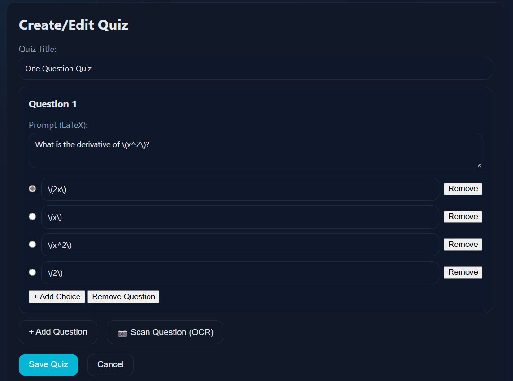
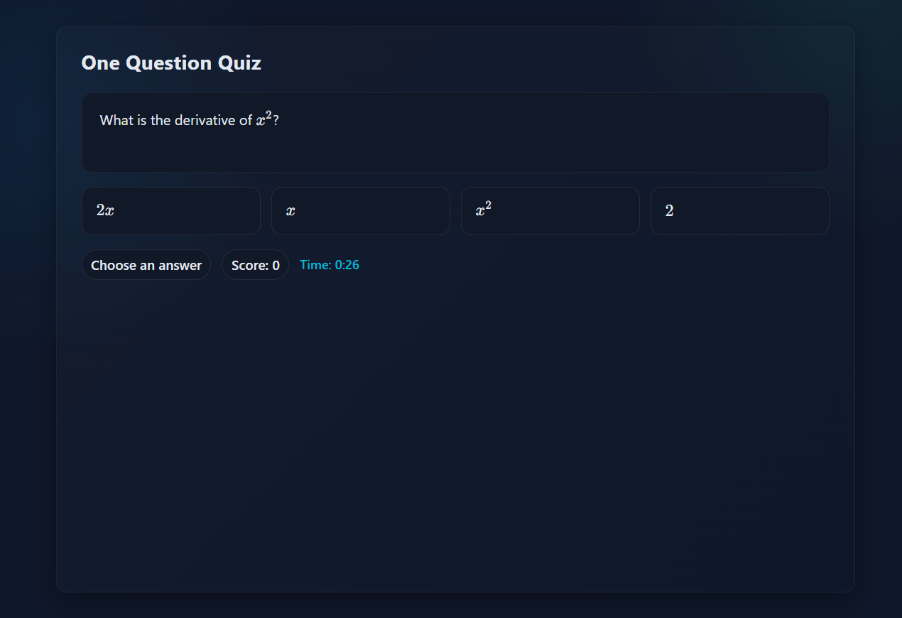
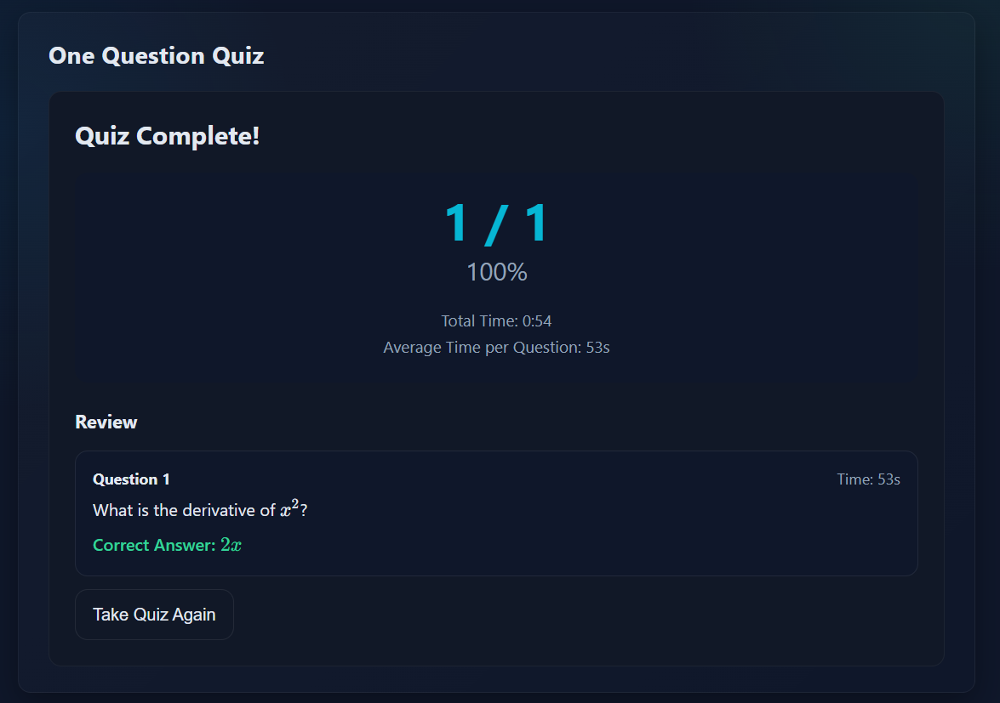

Quizleris project — a modular, browser-based math quiz app built with TypeScript + vanilla JS/HTML/CSS, 
featuring KaTeX math rendering, admin quiz creation, Tesseract.js OCR for scanning questions, and localStorage.

# Quizleris – Modular Math Quiz Web App

[](https://opensource.org/licenses/MIT)
[](https://www.typescriptlang.org/)
[](https://developer.mozilla.org/en-US/docs/Web/JavaScript)

**A lightweight, in-browser math quiz platform** where admins create custom quizzes with LaTeX equations, scan questions via OCR (Tesseract.js), and students play them locally. Built with TypeScript, no frameworks, pure DOM magic.

Live demo: [https://github.com/p0mkin/Quizleris/]

## Features

- **Math-friendly questions** — Full KaTeX support for LaTeX rendering in prompts and choices.
- **Admin mode** — Create/edit quizzes in-browser: add questions, multiple choices, mark correct answers.
- **OCR scanning** — Upload images/PDFs of math problems → Tesseract.js extracts text (great for printed/handwritten notes).
- **Quiz progression** — Multiple questions, score tracking, next-question button after answering.
- **Local persistence** — Save quizzes to browser localStorage (no backend yet — easy to add later).
- **Shareable** — Simple quiz IDs or JSON export for sharing with students.
- **No build tools required** — Compile TS once with `npx tsc`, serve with `http-server` or GitHub Pages.

## Screenshots

1. Admin creation screen.
   

2. Quiz player view with rendered math  
   

3. Result page example  
   

## Quick Start (for testing locally)

  **Clone the repo**
   ```bash
   git clone https://github.com/p0mkin/Quizleris.git
   cd Quizleris
  ```
  Auto-compile ( leave running )
  npm run dev ( runs: npm tsc --watch )

  Or

  Just Start server
  npm start   ( runs: http-server . -o )

--------------------------------------------------------------
To Edit A Quiz: Add this(?admin=true) to the link 
http://localhost:8080 / ?admin=true
--------------------------------------------------------------

  Project Structure:
  
textQuizleris/

├── ts/               # TypeScript source

│   └── app.ts

├── dist/             # Compiled JS output

│   └── app.js

├── screenshots/      # (add your images here)

├── index.html        # Main entry point

├── style.css         # Styling

├── tsconfig.json

├── package.json

├── global.d.ts       # Type declarations (KaTeX, Tesseract)

└── README.md

--------------------------------------------------------------

Tech Stack

TypeScript (ES2020 target, strict mode)

Vanilla JavaScript + DOM APIs

KaTeX (via CDN) for math rendering

Tesseract.js (via CDN) for OCR

localStorage for quiz persistence

No bundler (plain <script type="module">)

--------------------------------------------------------------

How to Contribute

Contributions welcome! 

Especially:

Better OCR parsing (math symbols, handwriting improvements)
Backend integration (e.g., SQLite/Node.js API for shared quizzes)
UI polish, timers, categories, etc.


Fork the repo

Create a branch: git checkout -b feature/my-cool-thing

Commit: git commit -m "Add my cool thing"

Push & open PR

--------------------------------------------------------------

Future Plans

Swap localStorage for real backend (SQL database via API)

Multi-user sharing via unique links/IDs

Advanced OCR (Mathpix or pix2tex integration for better math recognition)

Timer per question, high scores, categories

Export/import quiz JSON
